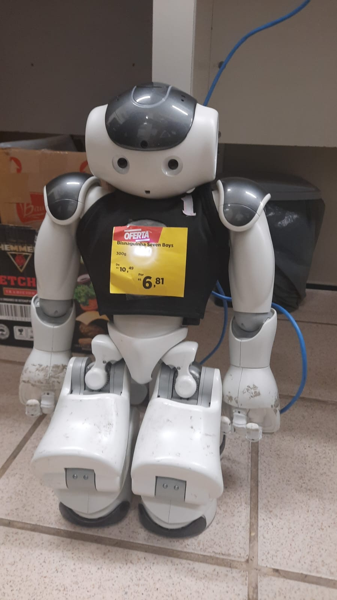

# Tamboerijn

This repo contains the codebase for Rinobot-Jaguar. 
It is based in the HULKs 2023 code release.

In the future we will add PT-BR docs.

See https://hulks.de/hulk/ for our documentation.

See https://hulks.de/ and https://hulks.de/publications/ for more information.

_dont ask about the name_

## License

Copyright (C) 2018-2023 HULKs e.V.

This software is licensed under the terms of the GNU GPLv3.

When using this software or parts thereof in a RoboCup SPL competition, the usage shall be announced on the RoboCup SPL mailing list (at the time of writing: robocup-nao@lists.robocup.org) at least one month prior to the competition.
The announcement shall name which parts of this software are used.

